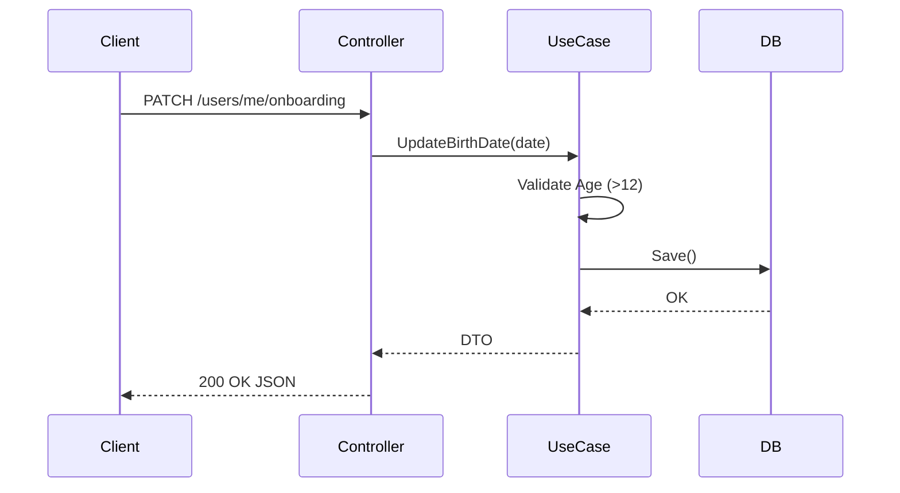

# SRS & Task Tracking Creator

This skill provides the structure and guidelines to generate two key documents for any new project or substantive modification:
1. **SRS Document** (e.g., `specs/backend_srs.md`)
2. **Tasks Document** (e.g., `specs/tasks.md`)

These guidelines enforce a comprehensive and structured approach to software design, adaptable to any technology stack, framework, or database. 

## When to use this skill
Use this skill whenever tasked with planning a new project, designing a new module, adding major features, or drafting requirements before starting implementation.

## 1. SRS Document Format

Always generate a markdown document following this exact structure and depth. Ensure that the document thoroughly defines the implementation expectations for the chosen technology stack. **Use the examples provided below as the gold standard for formatting and depth.**

### Header
```markdown
# **Documento de Arquitectura y Requisitos de Software ([Module/Project] SRS)**

**Proyecto:** [Project Name]
**Versión:** 1.0
**Fecha:** [Current Date]
**Autor:** [Author / AI Architect]
```

### 1. Visión General del Proyecto
Describe the purpose of the project/module, its main responsibilities, and Core Design Principles (e.g., Modularity, Scalability, Security, specific chosen architectural patterns like Clean Architecture, Hexagonal, MVC, etc.).

### 2. Stack Tecnológico
Provide a Markdown table defining the chosen technologies for the project with `Capa` (Layer), `Tecnología` (Technology), and `Justificación` (Justification).
**Example:**
| Capa | Tecnología | Justificación |
| :--- | :--- | :--- |
| **Lenguaje** | **Go (1.22+)** | Concurrencia y rendimiento. |
| **Base de Datos** | **PostgreSQL 16** | Soporte JSONB y robustez relacional. |

### 3. Arquitectura de Software
Describe the high-level architecture layers. Outline the expected directory structure. Explain the core design patterns that will be used based on the chosen stack and architectural style.
**Example (Clean Architecture in Go):**
```text
cmd/  
└── api/  
    └── main.go              # Entry point, Manual DI & Router setup  
internal/  
├── domain/                  # Entidades y Contratos (Interfaces)  
├── usecase/                 # Lógica de Negocio (Interactors)  
├── adapter/                 # Capa de Interface (Controllers / Serializers)  
└── infrastructure/          # Implementaciones Externas (DB / Cloud)
pkg/                         # Utilidades compartidas
```

### 4. Requisitos Funcionales (Detallados)
List functional requirements categorically by module. Use the ID format `RF-{Proyecto}-{Modulo}-{Numero}`.
**Example:**
* **RF-BE-USER-01 (Age Gate Server-Side):** The backend must validate the provided birth date.
  * If the calculated age is < 12 years, the request must be rejected with error 403 and the data discarded.
  * The date must be stored in ISO 8601 format.
* **RF-BE-USER-03 (Borrado Seguro):** When an account deletion is requested, the system must perform a *Soft Delete* immediately, and schedule a *Hard Delete* after 30 days.

### 5. Diseño de Base de Datos / Dominio
Provide Markdown tables for each database entity or domain model. Columns: `Columna`/`Propiedad`, `Tipo`, `Notas` (PK, FK, nullability, validations). Include database or storage specifics appropriate to the chosen technology.
**Example (PostgreSQL users table):**
#### **users**
| Columna | Tipo | Notas |
| :--- | :--- | :--- |
| id | UUID | PK, Generated by DB |
| email | VARCHAR | Unique, Not Null |
| preferences | JSONB | {theme: "system", lang: "es"} |
| created_at | TIMESTAMPTZ | auto-generated timestamp |

### 6. Especificación de Endpoints y Flujos (API)
Define the API endpoints meticulously (REST, GraphQL, gRPC, etc.).
**Example (REST Endpoint):**
#### **Update Onboarding (Age Gate)**
**Endpoint:** PATCH /api/v1/users/me/onboarding
**Handler/Controller:** `UserController.UpdateBirthDate`
**Request Body:**  
```json
{  
  "birth_date": "2015-05-20"  
}
```
**Success Response (200 OK):**  
```json
{  
  "id": "uuid-123",
  "birth_date": "2015-05-20",
  "status": "active"
}
```
**Error Responses:**  
* `403 Forbidden`: `USER_UNDER_AGE` (If calculated age < 12).  
* `400 Bad Request`: `INVALID_DATE_FORMAT`.

**Note on Standard Errors:** Explain the uniform error structure used across the API.
**Example Error Format:**
```json
{  
  "error": {  
    "code": "STRING_ERROR_CODE",  
    "message": "Human readable message",  
    "details": { "optional": "field" }  
  }  
}
```

### 7. Diagramas
Include Mermaid format sequence diagrams (`sequenceDiagram`), entity-relationship diagrams (`erDiagram`), or architecture diagrams illustrating typical request flows or data relationships.
**Example (Mermaid Sequence):**


---

## 2. Tasks Document Format

The Tasks document translates the SRS into actionable, component-level checklists. Group tasks by module to exactly match Section 4 of the SRS. Use it as a living tracker (e.g. `[x]`, `[ ]`).

### Header
```markdown
# [Project/Module Name] — Requisitos Funcionales

> Última actualización: [Current Date]

---
```

### Modules
Categorize tasks by referencing the exact RFs from the SRS. Translate each RF into atomic implementation tasks (e.g., Model creation, Logic implementation, API/Endpoint definition, Testing).

**Example:**
```markdown
## Módulo de Usuarios

- [ ] **RF-BE-USER-01** — Age Gate Server-Side
  - [ ] Implement `UpdateBirthDateUseCase` logic
  - [ ] Add age validation logic (< 12 -> 403)
  - [ ] Add endpoint `PATCH /api/v1/users/me/onboarding`
  - [ ] Write integration test for under-age rejection
```

### Infraestructura Transversal
Include a final section for foundational or overarching tasks if this is a new service:
**Example:**
```markdown
## Infraestructura Transversal

- [ ] Setup project structure
- [ ] Define domain entities / models
- [ ] Configure database connection / migrations
- [ ] Implement cross-cutting concerns (authentication, logging, standardized errors)
```

---

## Execution Workflow

1. **Understand Requirements:** Ask the user for the objective of the new project or modification. Gather details on entities, business rules, desired technology stack, architectural preferences, and endpoints needed.
2. **Draft the SRS:** Output or write a well-formatted SRS file (e.g., `specs/feature_srs.md`) based on the template above, tailored strictly to the user's chosen stack. Use the examples above as a qualitative benchmark.
3. **Draft the Tasks List:** Output or write a corresponding Task Document (e.g., `specs/feature_tasks.md`), mapping 1-to-1 to the functional requirements from the drafted SRS.
4. **Iterate:** Request user feedback, refine the requirements, adjust schemas, and align APIs before the user begins any coding.
